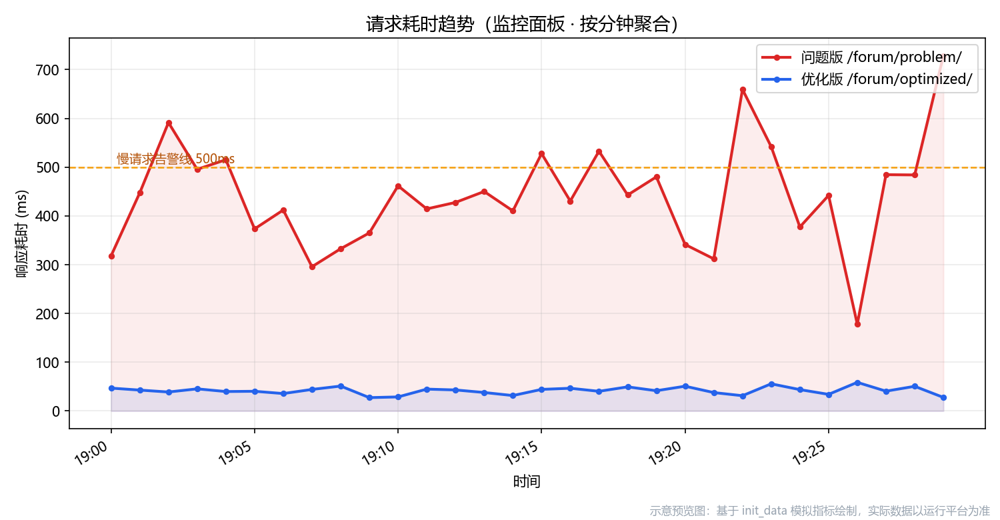
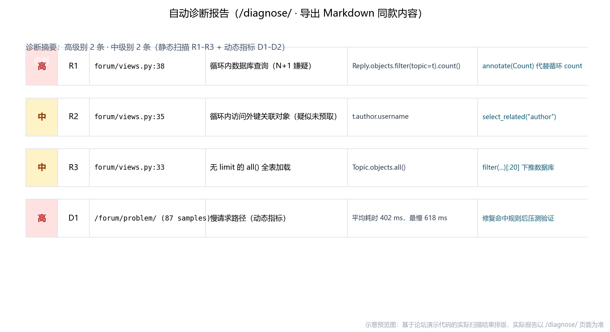

# 烽火台 Beacon Tower · 从"CPU 100%"到一站式可观测

> 一句话定位：对标腾讯云可观测平台的模块形态，用 Django + SQLite 自研出一套**数据收集 → 展示 → 分析 → 挖掘 → 告警 → 处置 → 优化**全链路闭环的运维监控系统——主机监控、APM 调用链、前端 RUM、日志服务、告警中心、智能分析、拨测/巡检/SLO/自愈运维中心、清理加速、自定义大盘、报表、故障演练，全部自包含，不依赖任何外部 SaaS。

## 这个项目解决什么问题

单一的性能监控面板回答不了运维的完整问题："服务现在健康吗？""用户端慢还是服务端慢？""错误什么时候开始的、和什么相关？""出事之前为什么没人知道？"。本项目把一个 Django 性能监控平台升级成**完整的可观测系统**：四大采集入口（请求中间件、psutil 主机线程、浏览器端 rum.js、日志 Handler）持续写入，一个指标注册表统一供数，分析、告警、挖掘算法全部自研且可解释——并用一个"故障演练控制台"让你亲手制造故障，亲眼看到数据、日志、告警在 30 秒内联动反应。

## 核心亮点

- **四大观测域全覆盖**：主机监控（psutil 真实采集）、APM（TraceID + SQL span 瀑布图）、前端 RUM（自研零依赖 JS SDK 上报 PV/LCP/JS 异常/API 耗时）、日志服务（Handler 自动接入 + 关键字检索）。
- **多服务器接入**：目标服务器跑自研 Agent（仅依赖 psutil），指标令牌推送到平台，主机页下拉切换各服务器——监控多少台就部署多少份 Agent。
- **自用级安全，经三轮红队审查打磨**：整站登录门禁 + 接入令牌**最小作用域**（令牌只能写上报端点，不能读任何数据 API/页面）；登录爆破锁定（错密码限流、正确密码放行防"锁人 DoS"）；上报接口限速与数值钳制；自愈命令白名单（拒绝 .bat）；出站请求 SSRF 校验 + 禁重定向；清理中心剪枝 Windows Junction 防删除越界；SMTP 授权码加密落库——威胁模型、审查记录与验证方法全部沉淀在 `SECURITY.md`。
- **告警之后的"处置闭环"**：拨测黑盒监控、巡检健康评分与磁盘/内存耗尽预测、SLO 错误预算燃尽、故障单自动聚合与 MTTR 统计、白名单自愈动作（冷却期 + 审计留痕），并提供清理加速中心（磁盘空间分析、垃圾清理、Windows 内存整理，全部先预估后执行、可审计）。
- **一个注册表打通全平台**（核心设计）：`monitor/registry.py` 内置 18 个指标 + 动态自定义指标，监控总览、自定义大盘、告警策略、异常检测、趋势预测、相关性分析全部从它取数——新增一个指标，所有功能即刻可用。
- **告警闭环**：策略（任意指标 + 阈值 + P0-P2 级别）→ 后台引擎每 30 秒评估 → 触发/恢复事件 → 站内信与模拟 Webhook 通知，支持并发去重自愈。
- **智能分析可解释**：滑动 3σ 异常检测（标注偏离倍数）、线性回归趋势预测（给出斜率与 R²）、皮尔逊相关性矩阵（热力图 + 解读）、日志模板聚类挖掘（数字/ID/路径归一化后找错误模式）。
- **AST 诊断引擎保留**（前身项目的核心创新）：静态扫描 N+1 / 未预取外键 / 无 limit 全表加载，结合动态慢查询数据互相印证，一键导出 Markdown 报告。
- **故障演练控制台**：一键触发慢请求 / N+1 / 500 错误 / 日志风暴 / CPU 空转，把"可观测性"变成可操作的实验。

## 效果预览

监控总览：KPI、请求/主机双趋势、错误分布、服务健康表、触发中告警横幅，10 秒自动刷新。



APM 接口分析：问题版（58 条 SQL、418ms）与优化版（4.5 条、46ms）的差异一目了然，每条请求可点进 TraceID 瀑布图：



*预览图基于演示数据排版，实际运行效果以平台页面为准。*

## 你将学到

- 可观测性三大支柱（Metrics / Tracing / Logging）如何在一个 Django 单体里落地
- 请求级 APM 采集：TraceID、`force_debug_cursor` 捕获 SQL、调用链 span 组装与瀑布图渲染
- 浏览器端监控 SDK 的完整实现：PerformanceObserver、fetch/XHR 包装、sendBeacon 批量上报
- psutil 主机采集线程与 Django 请求线程的并发共处（WAL、超时、daemon 线程）
- 告警引擎的设计：注册表取数、窗口均值判定、事件状态机、通知与去重
- 四种可解释的挖掘算法：滑动 3σ、最小二乘、皮尔逊、正则模板聚类
- Web 安全工程实战：认证门禁与令牌作用域设计、限速与登录锁定、SSRF 校验、
  Windows Junction 防逃逸、命令白名单——每一项都对应红队审查中的真实攻击场景

## 技术栈

| 类别 | 选型 |
|---|---|
| 语言 | Python 3.10+ |
| Web 框架 | Django 5.2 |
| 数据库 | SQLite（WAL 模式） |
| 主机采集 | psutil（未安装自动降级模拟） |
| 可视化 | ECharts 5（本地自托管） |
| 前端 SDK | 自研 rum.js（零依赖原生 JS） |
| 静态分析 | Python 标准库 ast |
| 监控对接 | Prometheus / Grafana（可选，平台自带 /metrics） |

## 快速开始

```bash
pip install -r requirements.txt
python manage.py migrate
python manage.py init_data          # 论坛内容 + 六大观测域 24 小时演示数据 + 告警策略 + 大盘卡片
python manage.py runserver 8014     # 端口 8014，启动即自动拉起采集与告警线程
```

打开 `http://127.0.0.1:8014/`（登录页内置只读演示账号，或用 `createsuperuser` 建自己的账号）看监控总览，到 `/forum/chaos/` 点"批量制造"，再到 `/alerts/events/` 等告警触发——完整的可观测闭环 10 分钟可以走完。

## 适合谁

需要 Web/运维方向毕业设计、或想系统搞懂"可观测平台内部是怎么实现的"的学习者。难度 ★★★★，每个模块都有"为什么要这样做"的注释，算法全部手写可解释，不是黑盒调包。

更多实现细节见项目内 `README.md` 与源码注释——**这里刻意没有展开**，留给你自己探索。
